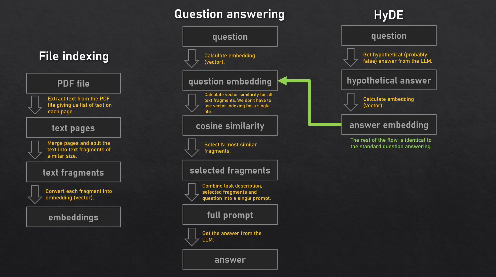
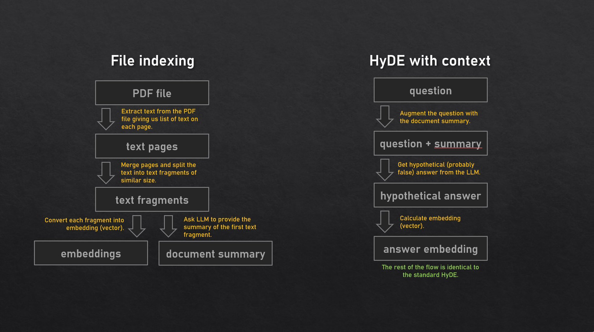

# Ask my PDF

Thank you for your interest in my application. Please be aware that this is only a **Proof of Concept system** and may contain bugs or unfinished features. If you like this app you can ❤️ [follow me](https://twitter.com/KerbalFPV) on Twitter for news and updates.

### Ask my PDF - Question answering system built on top of GPT3

🎲 The primary use case for this app is to assist users in answering  questions about board game rules based on the instruction manual. While  the app can be used for other tasks, helping users with board game rules is particularly meaningful to me since I'm an avid fan of board games  myself. Additionally, this use case is relatively harmless, even in  cases where the model may experience hallucinations.

🌐 The app can be accessed on the Streamlit Community Cloud at https://ask-my-pdf.streamlit.app/. 🔑 However, to use the app, you will need your own [OpenAI's API key](https://platform.openai.com/account/api-keys).

📄 The app implements the following academic papers:

- [In-Context Retrieval-Augmented Language Models](https://arxiv.org/abs/2302.00083) aka **RALM**

- [Precise Zero-Shot Dense Retrieval without Relevance Labels](https://arxiv.org/abs/2212.10496) aka **HyDE** (Hypothetical Document Embeddings)

### Diagrams: high-level documentation

#### RALM + HyDE

#### RALM + HyDE + context

### Environment variables used for configuration

General configuration:

- **STORAGE_SALT** - cryptograpic salt used when deriving user/folder name and encryption key from API key, hexadecimal notation, 2-16 characters

- **STORAGE_MODE** - index storage mode:  S3, LOCAL, DICT (default)

- **STATS_MODE** - usage stats storage mode: REDIS, DICT (default)

- **FEEDBACK_MODE** - user feedback storage mode: REDIS, NONE (default)

Local filesystem storage configuration:

- **STORAGE_PATH** - directory path for index storage

S3 based storage configuration:

- **S3_REGION** - region code

- **S3_BUCKET** - bucket name

- **S3_SECRET** - secret key

- **S3_KEY** - access key

- **S3_URL** - URL

- **S3_PREFIX** - object name prefix

Redis configuration (for persistent usage statistics / user feedback):

- **REDIS_URL** - Redis DB URL (redis[s]://:password@host:port/[db])

